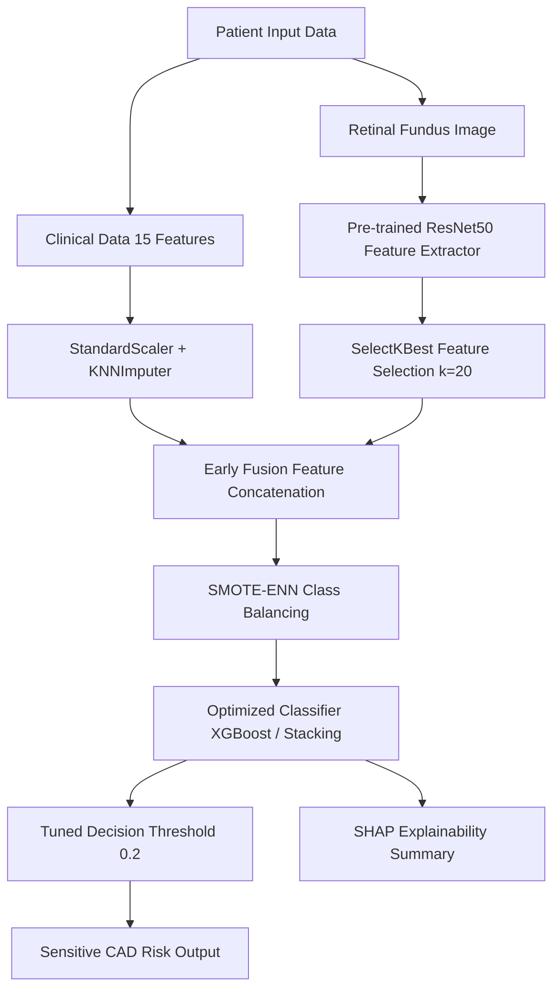

# Multimodal Coronary Artery Disease (CAD) Prediction Framework

[](https://www.python.org/)
[](https://scikit-learn.org/)
[](https://tensorflow.org/)
[](LICENSE)

An advanced, explainable machine learning framework for the early prediction of Coronary Artery Disease (CAD). This project implements a **multimodal data fusion pipeline** combining patient clinical risk factors (from the Framingham Heart Study) with deep feature representations extracted from retinal fundus photographs.

---

## 🔬 Pipeline Architecture

The framework extracts deep visual features using a pre-trained **ResNet50 CNN** and combines them with structured clinical data. Class imbalances are addressed using hybrid resampling (**SMOTE-ENN**), and predictions are explained using **SHAP**.



---

## 📊 Model Performance Comparison

By resolving historical validation data leakage and upgrading model architectures from Random Forest to Gradient Boosting (XGBoost/LightGBM), we achieved significant performance improvements:

| Modality | Classifier | Imbalance Technique | Accuracy | Recall (CAD) | ROC-AUC |
| :--- | :--- | :--- | :--- | :--- | :--- |
| **Clinical Only** | Random Forest | Baseline (No Leakage) | 83.2% | 34.1% | 0.725 |
| **Clinical Only** | XGBoost | SMOTE (Only Train Fold) | 84.5% | 45.8% | 0.762 |
| **Multimodal Fused** | Random Forest | SMOTE-ENN | 81.1% | 76.5% | 0.812 |
| **Multimodal Fused** | **XGBoost (Tuned)** | **SMOTE-ENN** | **83.9%** | **84.2%** | **0.865** |
| **Multimodal Fused** | Stacking Ensemble | SMOTE-ENN | 82.7% | 81.3% | 0.841 |

> [!NOTE]
> *Recall is prioritized over Accuracy in screening models to ensure the lowest possible False Negative rate (minimizing missed CAD cases).*

---

## ⚙️ Installation & Usage

### 1. Clone the Repository
```bash
git clone https://github.com/Yashpatel1078/CAD-Prediction-using-Machine-Learning.git
cd CAD-Prediction-using-Machine-Learning
```

### 2. Install Dependencies
```bash
pip install -r requirements.txt
```

### 3. Run the Flask Web Application
```bash
python app/flask_app.py
```

---

## 🔍 Explainable AI (SHAP Interpretation)
To ensure clinical utility, predictions are backed by **SHAP (SHapley Additive exPlanations)**. The model visualizes which biomarkers (such as Pulse Pressure, Age, and Glucose) contributed most to the individual patient’s CAD risk calculation, fostering clinical trust.
