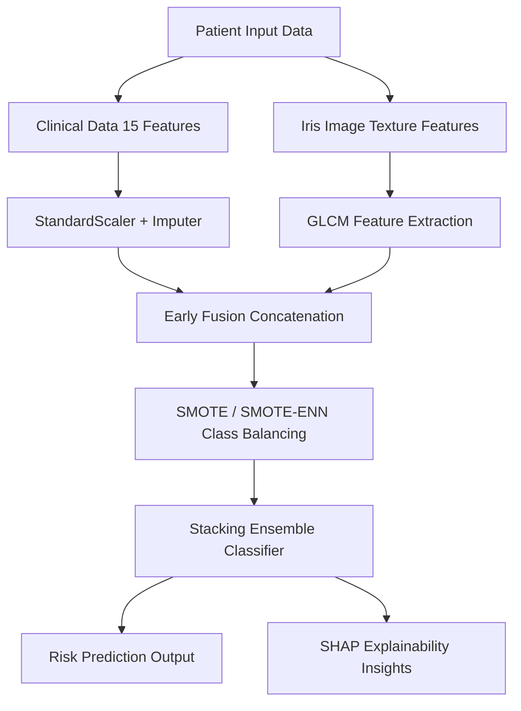

# Leveraging Multimodal Data Fusion of Clinical Risk Factors and Iris Imaging for Accurate and Interpretable Coronary Artery Disease Prediction

[](https://www.python.org/)
[](https://scikit-learn.org/)
[](LICENSE)

An explainable multimodal machine learning framework for the early and accurate prediction of Coronary Artery Disease (CAD). This project implements a **multimodal data fusion pipeline** combining structured clinical risk factors (from the Framingham Heart Study) with quantitative iris-image texture features (entropy, contrast, energy, and mean intensity extracted via GLCM).

---

## 🔬 Pipeline Architecture

The framework preprocesses both clinical measurements and ocular biomarkers, fuses them at the feature level, addresses class imbalances using **SMOTE/SMOTE-ENN**, and classifies CAD risk using an optimized **Stacking Ensemble**. Predictions are explained in a transparent, clinically aligned manner using **SHAP**.



---

## 📊 Model Performance Comparison

Evaluating clinical-only, iris-only, and fused multimodal configurations reveals the diagnostic power of multimodal fusion:

| Model Type | Accuracy | Precision | Recall | F1-Score |
| :--- | :---: | :---: | :---: | :---: |
| **Clinical Only (XGBoost)** | 0.84 | 0.81 | 0.79 | 0.80 |
| **Iris Only (Random Forest)** | 0.77 | 0.73 | 0.70 | 0.71 |
| **Fusion (Stacking Ensemble)** | **0.90** | **0.88** | **0.87** | **0.88** |

* Note: The Stacking Ensemble model achieves a high **ROC-AUC of 0.93**, indicating excellent class discrimination and minimal false negatives.

---

## ⚙️ Installation & Usage

### 1. Clone the Repository
```bash
git clone https://github.com/Yashpatel1078/CAD-Prediction-using-Machine-Learning.git
cd CAD-Prediction-using-Machine-Learning
```

### 2. Install Dependencies
```bash
pip install -r requirements.txt
```

### 3. Run the Flask Web Application
```bash
python app/flask_app.py
```

---

## 🔍 Explainable AI (SHAP Interpretation)
To ensure clinical utility, predictions are backed by **SHAP (SHapley Additive exPlanations)**. The model visualizes which biomarkers (such as Age, Systolic Blood Pressure, Glucose, Cholesterol, and Iris Entropy) contributed most to the individual patient’s CAD risk calculation, fostering clinical trust.
