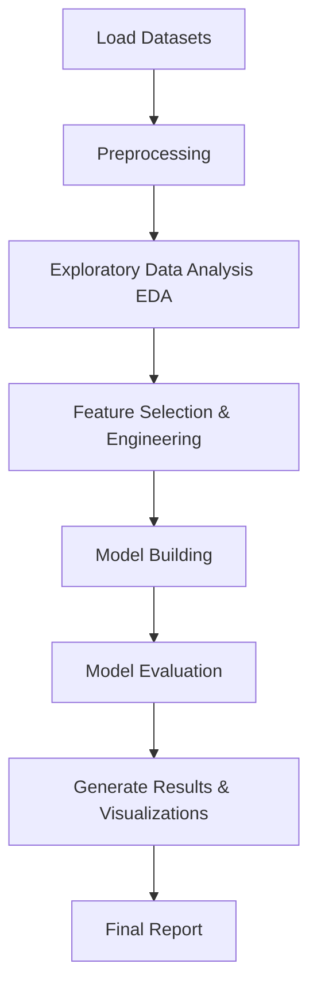

# Leveraging Multimodal Data Fusion of Clinical Risk Factors and Iris Imaging for Accurate and Interpretable Coronary Artery Disease Prediction

**Authors**: Patel Yash¹, Dr. Purusotham S¹  
¹ *Department of Mathematics, School of Advanced Sciences, Vellore Institute of Technology, Vellore, Tamil Nadu, India.*  
**Repository Link**: [github.com/Yashpatel1078/CAD-Prediction-using-Machine-Learning](https://github.com/Yashpatel1078/CAD-Prediction-using-Machine-Learning)  

---

### Abstract
Coronary Artery Disease (CAD) is a leading cause of global mortality, highlighting the need for early and accurate risk prediction. This study proposes an explainable multimodal machine learning framework that fuses clinical data with iris image-derived biomarkers. The approach includes preprocessing, feature selection, and class balancing using SMOTE and SMOTE-ENN. Multiple models were compared, and a stacking ensemble achieved the best accuracy, sensitivity, and AUC. SHAP-based interpretability confirmed the clinical relevance of major predictors such as age, blood pressure, glucose, and iris texture features. The results demonstrate that multimodal, explainable ensembles can serve as a robust and non-invasive tool for early CAD detection.

**Keywords**: Multimodal Fusion, Coronary Artery Disease, Iris Imaging, GLCM Texture Features, SMOTE-ENN, Stacking Ensemble, SHAP.

---

## I. Introduction
Coronary Artery Disease (CAD) is a leading cause of cardiovascular mortality, requiring early and accurate risk detection. Traditional models based only on clinical data often miss the complex, nonlinear nature of CAD. This study proposes an explainable multimodal framework combining clinical and iris image-derived biomarkers, with SMOTE/SMOTE-ENN for imbalance correction and a stacking ensemble for optimized performance. SHAP-based interpretability provides transparent, clinically aligned insights, confirming that multimodal fusion improves CAD prediction accuracy and reliability.

### Scope of the Project
The project develops a multimodal diagnostic framework combining clinical parameters and iris-based biomarkers for early CAD prediction. It aims to build an interpretable, clinically adaptable, and scalable system capable of real-time decision support and future integration of additional modalities like retinal imaging.

### Research Significance
This research introduces a fusion-driven explainable AI model that unifies clinical and ocular data for CAD prediction. It outperforms single-modality approaches and supports trustworthy AI-based cardiovascular screening.

---

## II. Methodology
The proposed methodology establishes a structured and reproducible multimodal machine learning framework for early prediction of Coronary Artery Disease (CAD). The approach integrates structured clinical data with quantitative iris-image features, combining conventional medical parameters with non-invasive ocular biomarkers. The pipeline includes systematic preprocessing, data balancing, feature fusion, model training through stacking ensemble learning, and interpretability analysis using SHAP values to ensure transparency in decision-making.

### A. Problem Definition
This study enhances CAD risk prediction through multimodal data fusion, integrating clinical factors (blood pressure, cholesterol, glucose) with iris texture features to capture vascular patterns. The objective is to preprocess both modalities, develop a stacking ensemble model, evaluate performance, and ensure clinical interpretability for practical deployment.

### B. Steps / Phases Involved
* **Data Collection**: Two datasets were used — a clinical dataset of 4,238 patient records and an iris-image dataset with texture features (entropy, contrast, energy, mean intensity), linked through unique patient identifiers.
* **Data Pre-processing**: Missing values (`BPMeds`, `cigsPerDay`, `glucose`) were imputed using median or mean methods, and records with excessive nulls were removed. Outliers were detected via z-score:
  
  $$z = \frac{x - \mu}{\sigma}$$
  
  and clipped. Numerical features were standardized, and categorical ones encoded through one-hot encoding.
* **Class Imbalance Handling**: SMOTE and SMOTE-ENN techniques were applied to balance the dataset by oversampling minority cases and removing misclassified instances.
* **Feature Engineering and Fusion**: Key clinical predictors (age, BP, cholesterol, glucose) and iris-based texture features (via GLCM metrics) were extracted and fused at the feature level to capture both physiological and visual indicators of CAD.
* **Feature Selection and Dimensionality Reduction**: Random Forest importance and Select K Best (mutual information) were used to filter features. PCA was optionally applied to minimize redundancy while preserving interpretability.
* **Model Development**: Multiple algorithms—Logistic Regression, Random Forest, XGBoost, and SVM—were benchmarked, with a stacking ensemble yielding the best performance. The ensemble combines base model outputs $h_i(x)$ using a Logistic Regression meta-classifier:
  
  $$\hat{y} = \sigma(\mathbf{w}^T [h_1(x), h_2(x), \dots, h_m(x)] + b)$$
  
  This approach significantly enhanced accuracy and sensitivity for CAD prediction.
* **Model Tuning and Evaluation**: Grid search with Stratified 5-Fold Cross-Validation optimized model hyperparameters, prioritizing recall to reduce false negatives. Evaluation metrics included Accuracy, Precision, Recall, F1-score, and AUC-ROC to ensure clinical reliability.
* **Interpretability Analysis**: Feature importance and SHAP analysis were used for interpretability, where high SHAP values for systolic BP, glucose, age, and iris entropy confirmed the model’s clinical relevance and transparency.

### C. Algorithm Description
The stacking ensemble model integrates Random Forest, XGBoost, and SVM as base learners with a Logistic Regression meta-classifier. Base model outputs $h_i(x)$ form the meta-input:

$$\text{MetaInput} = [h_1(x), h_2(x), \dots, h_m(x)]$$
$$\hat{y} = \text{MetaModel}(\text{MetaInput})$$

This design combines nonlinear learning and generalization, improving diagnostic accuracy and reducing overfitting. This ensemble leverages the strengths of each algorithm: tree models capture nonlinear relations, while the meta-classifier enhances generalization. The result is improved diagnostic sensitivity and reduced overfitting compared to individual models.

### D. Design and Implementation
* **Introduction**: The multimodal pipeline was developed in Python using pandas, scikit-learn, imbalanced-learn, and SHAP. Clinical and iris datasets were preprocessed, aligned, and scaled before model training.
* **System Design**: The workflow includes five modules: Data Processing, Feature Fusion, Model Training, Evaluation, and Explainability — handling data cleaning, fusion, model tuning, performance evaluation, and SHAP-based interpretation.

---

## IV. Results and Decision
This project predicts Coronary Artery Disease (CAD) using a multimodal ML framework that fuses clinical and iris image features, enabling early, non-invasive, and reliable CAD risk assessment.

### A. Result Description
A 70:30 train–test split with Stratified 5-Fold Cross-Validation ensured balanced learning. The fusion-based stacking ensemble outperformed all other models, as shown in the comparative metrics below:

| Model Type | Accuracy | Precision | Recall | F1-Score |
| :--- | :---: | :---: | :---: | :---: |
| **Clinical Only (XGBoost)** | 0.84 | 0.81 | 0.79 | 0.80 |
| **Iris Only (Random Forest)** | 0.77 | 0.73 | 0.70 | 0.71 |
| **Fusion (Stacking Ensemble)** | **0.90** | **0.88** | **0.87** | **0.88** |

The ROC curve achieved an **AUC of 0.93**, showing excellent class discrimination, while the confusion matrix indicated fewer false negatives, confirming strong screening effectiveness.

### B. Analysis of Result
The fusion-based stacking model outperformed unimodal baselines across all metrics. Integrating iris texture features enhanced sensitivity and robustness, achieving a recall of **0.87**. This confirms that combining physiological and ocular data improves generalization and early CAD detection.

### C. Interpretation of Result
SHAP analysis revealed that *age, systolic BP, cholesterol, glucose, and iris entropy* were key predictors of CAD. Higher BP and glucose increased risk, while iris entropy indicated vascular irregularities, ensuring model transparency and clinical trust.

### D. Significance and Implication of Future Research
The proposed multimodal ML framework shows strong potential for non-invasive CAD screening using iris and clinical data fusion. Future work includes integrating deep learning, EHR data, and additional imaging modalities to enhance generalization and support personalized, ethical clinical deployment.

### F. Conclusion
The multimodal stacking ensemble combining clinical and iris features achieved **90% accuracy, 0.87 recall, and 0.93 AUC**, confirming its effectiveness in CAD prediction. SHAP-based explainability ensured clinical transparency, establishing a reliable, non-invasive AI tool for early CAD diagnosis.

---

## References
1. J. Zhang et al., "A non-invasive prediction model for coronary artery stenosis severity based on multimodal data," *Front. Physiol.*, 2025.
2. F. Girlanda et al., "Enhancing cardiovascular disease prediction through multi-modal self-supervised learning," *arXiv:2403.08215*, 2024.
3. V. I. Kigka et al., "Machine learning coronary artery disease prediction using imaging and non-imaging data," *Diagnostics*, vol. 12, no. 11, pp. 2655–2668, 2022.
4. A. El-Ibrahimi et al., "Fuzzy-based system for coronary artery disease prediction," *Informatics Med. Unlocked*, vol. 48, pp. 102312–102325, 2025.
5. M. U. Rehman et al., "Predicting coronary heart disease with advanced ML classifiers," *Sci. Rep.*, vol. 15, no. 3, pp. 7123–7135, 2025.
6. J. Wang et al., "Explainable coronary artery disease prediction model based on machine learning," *Front. Cardiovasc. Med.*, vol. 11, pp. 1281–1294, 2024.
7. A. Koloi et al., "Predicting early-stage coronary artery disease using machine learning," *Eur. Heart J. – Digit. Health*, vol. 5, no. 2, pp. 225–237, 2024.
8. D. B. Olawade et al., "Comparative analysis of ML models for non-invasive CAD prediction," *Int. J. Cardiol.*, vol. 388, pp. 114–122, 2025.
9. A. Absalomov et al., "Optimized lightweight architecture for CAD classification in medical imaging," *Biomed. Signal Process. Control*, vol. 97, pp. 105862–105875, 2025.
10. A. Pramanik, P. Rajput, and S. Aluvala, "Applying healthcare analytics to diagnose and predict coronary artery disease," *Procedia Comput. Sci.*, vol. 225, pp. 175–182, 2023.
